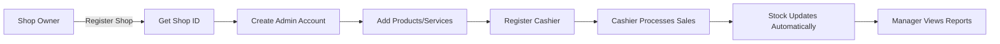

<div align="center">

# 🛒 Multi-Tenant POS System

### Professional Point of Sale System for Retail Shops & Supermarkets

[](https://reactjs.org/)
[](https://nodejs.org/)
[](https://www.sqlite.org/)
[](LICENSE)

**A modern, secure, and scalable Point of Sale system designed for retail shops and supermarkets with complete multi-tenant architecture.**

[Features](#-features) • [Installation](#-installation) • [Usage](#-usage) • [Tech Stack](#-tech-stack) • [Documentation](#-documentation)

---

</div>

## 🎯 Overview

This is a comprehensive **Multi-Tenant Point of Sale (POS) System** built specifically for retail shops and supermarkets. Each shop operates with its own isolated database, ensuring complete data privacy and security. The system supports products (pens, rubbers, pencils, drinks, envelopes) and services (photocopying, scanning, passport applications, ID services).

### ✨ Key Highlights

- 🏪 **Multi-Tenant Architecture** - Each shop has its own isolated SQLite database
- 🔐 **Secure Authentication** - JWT-based with role-based access control
- 📊 **Real-time Inventory** - Visual stock alerts and automatic notifications
- 💰 **Complete Sales Management** - Products, services, transactions, and receipts
- 📈 **Analytics & Reports** - Comprehensive business insights
- 🌍 **Kenyan Timezone** - All timestamps in EAT (UTC+3) for accurate tracking

---

## 🚀 Features

### 🏗️ Architecture & Security

- **🏢 Multi-Tenant Architecture**: Each shop gets its own SQLite database with unique 5-character Shop ID
- **🔐 Role-Based Access Control**: Three distinct roles (Admin, Manager, Cashier) with granular permissions
- **🛡️ Enterprise Security**: JWT authentication, bcrypt password hashing, SQL injection prevention
- **🔒 Manager Protection**: Read-only access for managers - cannot make changes, only view

### 📦 Product & Inventory Management

- **📋 Product Management**: Track inventory, prices, stock levels with minimum stock alerts
- **⚙️ Service Management**: Handle services like photocopying, scanning, passport applications
- **📊 Smart Stock Alerts**: Visual indicators (red borders) when stock reaches minimum levels
- **🚨 Out of Stock Protection**: Prevents sales when products are unavailable
- **📝 Inventory Logs**: Complete audit trail of all stock changes (restocks, sales, adjustments)

### 💳 Point of Sale

- **🛒 Fast Checkout**: Streamlined POS interface for quick transactions
- **🎨 Visual Stock Alerts**: Red borders and backgrounds for low/out of stock items
- **💵 Multiple Payment Methods**: Cash, Card, Mobile Money support
- **🧾 Receipt Generation**: Complete transaction records with itemized details
- **✅ Real-time Validation**: Stock availability checked before checkout

### 📈 Reports & Analytics

- **📊 Sales Reports**: Daily, weekly, monthly sales analytics
- **🏆 Top Products**: Best-selling items tracking
- **📉 Inventory Reports**: Stock levels, low stock alerts, restock history
- **💰 Revenue Tracking**: Complete financial overview
- **📅 Time-based Analysis**: Filter reports by date ranges

### 🌍 Localization

- **🇰🇪 Kenyan Timezone**: All timestamps in EAT (East Africa Time - UTC+3)
- **💱 Currency Formatting**: Prices displayed in KSH (Kenyan Shillings)
- **📅 Date Formatting**: Localized date and time display

---

## 🛠️ Tech Stack

### Frontend
- ⚛️ **React 18+** - Modern UI library
- ⚡ **Vite** - Lightning-fast build tool
- 🎨 **Tailwind CSS** - Utility-first CSS framework
- 🔄 **React Router** - Client-side routing
- 📡 **Axios** - HTTP client for API calls

### Backend
- 🟢 **Node.js** - JavaScript runtime
- 🚀 **Express.js** - Web application framework
- 🗄️ **SQLite (better-sqlite3)** - Lightweight database
- 🔐 **JWT** - JSON Web Tokens for authentication
- 🔒 **bcryptjs** - Password hashing
- 🛡️ **Helmet** - Security middleware
- ✅ **express-validator** - Input validation

### Database
- 📦 **SQLite** - One database per shop for complete isolation
- 🗂️ **Master Database** - Central shop registry
- 📊 **Schema**: Users, Products, Services, Transactions, Inventory Logs, Audit Logs

---

## 📦 Installation

### Prerequisites

- Node.js 18+ installed
- npm or yarn package manager
- Git (for cloning)

### Step 1: Clone the Repository

```bash
git clone https://github.com/Wynemods/-multi-tenant-POS.git
cd -multi-tenant-POS
```

### Step 2: Backend Setup

```bash
# Navigate to backend directory
cd backend

# Install dependencies
npm install

# Create environment file
cp .env.example .env

# Edit .env file and add your JWT_SECRET
# Example:
# JWT_SECRET=your-super-secret-key-here
# PORT=5000
# JWT_EXPIRES_IN=24h

# Start development server
npm run dev
```

✅ Backend will run on `http://localhost:5000`

### Step 3: Frontend Setup

```bash
# Navigate to frontend directory (from project root)
cd frontend

# Install dependencies
npm install

# Start development server
npm run dev
```

✅ Frontend will run on `http://localhost:3000` (or port shown in terminal)

---

## 🎮 Usage Guide

### 1️⃣ Register Your Shop

1. Navigate to `/register-shop`
2. Fill in shop details:
   - Shop Name
   - Owner Name
   - Email & Phone
   - Address
   - Password
3. **Save your Shop ID** - You'll receive a unique 5-character ID (e.g., `A3K7M`)
4. This creates your admin account automatically

### 2️⃣ Register Additional Users

1. Navigate to `/register`
2. Enter:
   - **Shop ID** (from step 1)
   - Full Name
   - Email
   - Select Role: **Cashier** or **Manager**
   - Password
3. Click "Register Account"

### 3️⃣ Login to System

1. Navigate to `/login`
2. Enter:
   - **Shop ID**
   - **Email**
   - **Password**
   - **Role** (Cashier or Manager)
3. Click "Sign In"

### 4️⃣ Manage Products

1. Go to **Products** page
2. Click **"+ Add Product"**
3. Fill in:
   - Product Name *
   - Category
   - Price (KSH) *
   - Stock Quantity *
   - **Min Stock Level** * (Required - triggers alerts)
   - Unit
4. Save product

### 5️⃣ Manage Services

1. Go to **Services** page
2. Click **"+ Add Service"**
3. Enter:
   - Service Name *
   - Description
   - Price (KSH) *
   - Duration (optional)
4. Save service

### 6️⃣ Process Sales (POS)

1. Go to **POS** page
2. **Visual Indicators**:
   - 🟢 **Green Border**: Normal stock
   - 🔴 **Red Border**: Low stock (≤ min level)
   - 🔴 **Red Background**: Out of stock
3. Click products/services to add to cart
4. Adjust quantities
5. Select payment method
6. Click **"Checkout"**

### 7️⃣ View Reports

1. Go to **Reports** page
2. View:
   - Daily sales
   - Top products
   - Revenue analytics
   - Recent transactions

---

## 👥 User Roles & Permissions

### 👑 Admin
- ✅ Full system control
- ✅ Create/Edit/Delete products and services
- ✅ Manage inventory (restock)
- ✅ View all reports and analytics
- ✅ Access settings
- ✅ Process sales

### 👔 Manager (Read-Only)
- ✅ View all products and services
- ✅ View inventory levels and low stock alerts
- ✅ View inventory activity logs (restocks, sales)
- ✅ View all transactions
- ✅ View reports and analytics
- ❌ **Cannot make any changes** (write-protected)

### 💼 Cashier
- ✅ Process sales and transactions
- ✅ Create/Edit products and services
- ✅ Manage inventory (restock)
- ✅ View products, services, transactions
- ❌ Cannot access reports or settings

---

## 🚨 Stock Alert System

### Visual Indicators in POS

| Status | Visual | Description |
|--------|--------|-------------|
| 🟢 **Normal Stock** | Gray border | Stock > min_stock_level |
| 🟡 **Low Stock** | Red border + Red background | Stock ≤ min_stock_level |
| 🔴 **Out of Stock** | Red border + Red background + "Out of Stock" | Stock = 0 |

### Features

- **📊 Real-time Alerts**: Products automatically show red borders when stock is low
- **🚫 Sales Prevention**: Out of stock items cannot be added to cart
- **✅ Backend Validation**: Stock checked before checkout to prevent overselling
- **📝 Activity Logging**: All stock changes logged with timestamps
- **🔔 Inventory Page**: Dedicated low stock alerts section

---

## 🗄️ Database Structure

### Master Database
- **Shops Table**: Central registry of all shops
  - Shop ID, Name, Owner, Contact, Database Path

### Shop Databases (One per shop)
- **Users**: Admin, Manager, Cashier accounts
- **Products**: Inventory items with stock tracking
- **Services**: Service offerings
- **Transactions**: Sales records
- **Transaction Items**: Individual items in each sale
- **Inventory Logs**: Complete audit trail of stock changes
- **Audit Logs**: System activity tracking

---

## 🔐 Security Features

- 🔑 **JWT Authentication**: Secure token-based authentication
- 🔒 **Password Hashing**: bcrypt with salt rounds
- 🛡️ **Role-Based Access Control**: Granular permissions per role
- ✅ **Input Validation**: Server-side validation for all inputs
- 🚫 **SQL Injection Prevention**: Parameterized queries
- 🔐 **Manager Write Protection**: Middleware blocks write operations
- 🌐 **CORS Protection**: Configured for secure cross-origin requests
- 🔒 **Helmet Security**: Additional HTTP security headers

---

## 🌍 Timezone & Localization

### EAT (East Africa Time - UTC+3)
- ✅ All timestamps stored in Nairobi timezone
- ✅ Accurate Kenyan time tracking
- ✅ No daylight saving time adjustments needed
- ✅ Consistent across all transactions and logs

### Currency
- 💱 **KSH (Kenyan Shillings)**: All prices displayed in local currency
- 💵 Format: `KSH 1,234.56`

---

## 📁 Project Structure

```
📦 multi-tenant-POS
├── 📂 backend
│   ├── 📂 src
│   │   ├── 📂 config
│   │   │   └── database.js          # Database initialization
│   │   ├── 📂 middleware
│   │   │   ├── auth.js              # Authentication & authorization
│   │   │   ├── errorHandler.js      # Error handling
│   │   │   └── readOnly.js          # Manager write protection
│   │   ├── 📂 routes
│   │   │   ├── authRoutes.js        # Login, Register
│   │   │   ├── productRoutes.js     # Product CRUD
│   │   │   ├── serviceRoutes.js     # Service CRUD
│   │   │   ├── transactionRoutes.js # Sales & Checkout
│   │   │   ├── inventoryRoutes.js   # Stock management
│   │   │   └── reportRoutes.js      # Analytics
│   │   ├── 📂 utils
│   │   │   ├── shopIdGenerator.js   # Unique Shop ID generation
│   │   │   └── timezone.js           # EAT timezone utilities
│   │   └── server.js                 # Express server setup
│   ├── 📂 database
│   │   ├── master.db                 # Master shop registry
│   │   └── shops/                     # Individual shop databases
│   ├── package.json
│   └── .env                           # Environment variables
│
└── 📂 frontend
    ├── 📂 src
    │   ├── 📂 components
    │   │   ├── Alert.jsx             # Toast notifications
    │   │   ├── ConfirmModal.jsx      # Confirmation dialogs
    │   │   ├── Header.jsx            # Top navigation
    │   │   ├── Layout.jsx            # Main layout wrapper
    │   │   ├── ProtectedRoute.jsx    # Route protection
    │   │   ├── ShopIdModal.jsx       # Shop ID display
    │   │   └── Sidebar.jsx            # Navigation sidebar
    │   ├── 📂 context
    │   │   ├── AuthContext.jsx       # Authentication state
    │   │   └── ToastContext.jsx      # Toast notifications
    │   ├── 📂 pages
    │   │   ├── Login.jsx             # Login page
    │   │   ├── Register.jsx           # User registration
    │   │   ├── RegisterShop.jsx      # Shop registration
    │   │   ├── POS.jsx               # Point of Sale interface
    │   │   ├── Products.jsx          # Product management
    │   │   ├── Services.jsx          # Service management
    │   │   ├── Transactions.jsx     # Transaction history
    │   │   ├── Inventory.jsx        # Inventory management
    │   │   ├── Reports.jsx           # Analytics & reports
    │   │   └── Settings.jsx          # System settings
    │   ├── 📂 utils
    │   │   ├── api.js                # API client
    │   │   └── formatters.js         # Currency & date formatting
    │   ├── App.jsx                    # Main app component
    │   ├── main.jsx                   # Entry point
    │   └── index.css                  # Global styles
    ├── package.json
    ├── tailwind.config.js
    ├── vite.config.js
    └── postcss.config.js
```

---

## 🚀 Development

### Running the Application

```bash
# Terminal 1 - Backend
cd backend
npm run dev

# Terminal 2 - Frontend
cd frontend
npm run dev
```

### Default Ports

- **Backend API**: `http://localhost:5000`
- **Frontend App**: `http://localhost:3000` (or port shown in terminal)

### Environment Variables

Create a `.env` file in the `backend` directory:

```env
PORT=5000
JWT_SECRET=your-super-secret-key-change-in-production
JWT_EXPIRES_IN=24h
NODE_ENV=development
```

---

## 📊 API Endpoints

### Authentication
- `POST /api/auth/register` - Register new user (Manager/Cashier)
- `POST /api/auth/register-shop` - Register new shop (Admin)
- `POST /api/auth/login` - User login
- `GET /api/auth/me` - Get current user

### Products
- `GET /api/products` - Get all products
- `GET /api/products/:id` - Get single product
- `POST /api/products` - Create product
- `PUT /api/products/:id` - Update product
- `DELETE /api/products/:id` - Delete product
- `GET /api/products/low-stock` - Get low stock products

### Services
- `GET /api/services` - Get all services
- `GET /api/services/:id` - Get single service
- `POST /api/services` - Create service
- `PUT /api/services/:id` - Update service
- `DELETE /api/services/:id` - Delete service

### Transactions
- `GET /api/sales` - Get all transactions
- `GET /api/sales/:id` - Get transaction details
- `POST /api/sales/checkout` - Process checkout

### Inventory
- `POST /api/inventory/restock` - Restock product
- `GET /api/inventory/logs` - Get inventory activity logs

### Reports
- `GET /api/reports/dashboard` - Get dashboard data
- `GET /api/reports/sales` - Get sales reports

---

## 🎨 UI/UX Features

- 🎨 **Modern Design**: Clean, professional interface with Tailwind CSS
- 📱 **Responsive Layout**: Works on desktop and tablet devices
- 🎯 **Intuitive Navigation**: Easy-to-use sidebar navigation
- 🔔 **Toast Notifications**: Beautiful, non-intrusive alerts
- ✅ **Form Validation**: Real-time input validation
- 🎭 **Modal Dialogs**: Styled confirmation and information modals
- 🎨 **Color-Coded Alerts**: Visual stock status indicators
- 💫 **Smooth Animations**: Transitions and hover effects

---

## 🔄 Workflow Example



---

## 📝 License

This project is licensed under the **ISC License**.

---

## 🤝 Contributing

Contributions are welcome! Please feel free to submit a Pull Request.

---

## 📧 Support

For issues, questions, or contributions, please open an issue on [GitHub](https://github.com/Wynemods/-multi-tenant-POS/issues).

---

<div align="center">

### ⭐ Star this repo if you find it useful!

**Built with ❤️ for Kenyan Retail Businesses**

[⬆ Back to Top](#-multi-tenant-pos-system)

</div>
